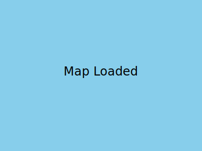

# Dev Environment Setup

`make dev-up` provisions a Python virtual environment and prepares local assets for the chart tiler.

## Environment variables

- `ENC_DIR` – override path to ENC datasets
- `MBTILES_CACHE_SIZE` – in-memory MBTiles cache size
- `REDIS_URL` / `REDIS_TTL` – optional Redis cache and TTL
- `GEO_LRU_SIZE` – geospatial transform cache size
- `IMPORT_API_ENABLED` – enable import endpoints

## Ports

- Chart tiler: `8000`
- Web client: `3000`

## Expected result

Open `http://localhost:3000/` and verify the map loads:

